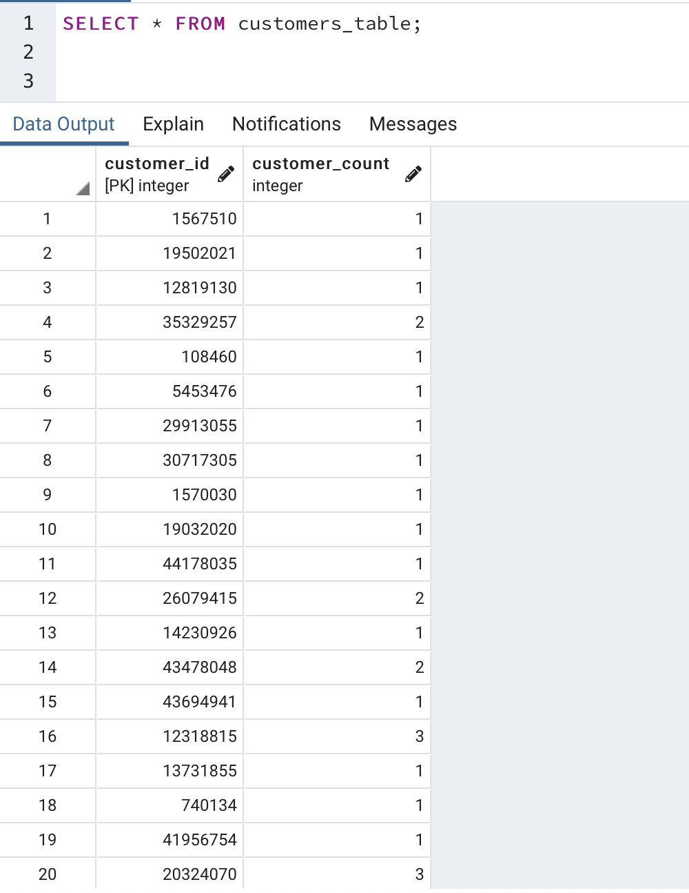
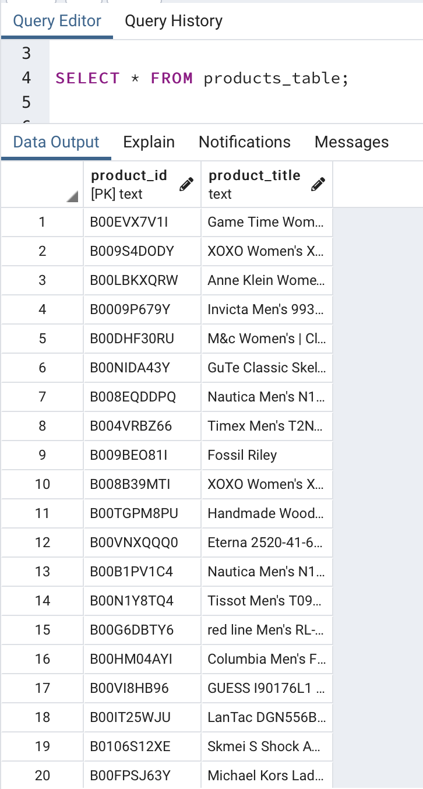
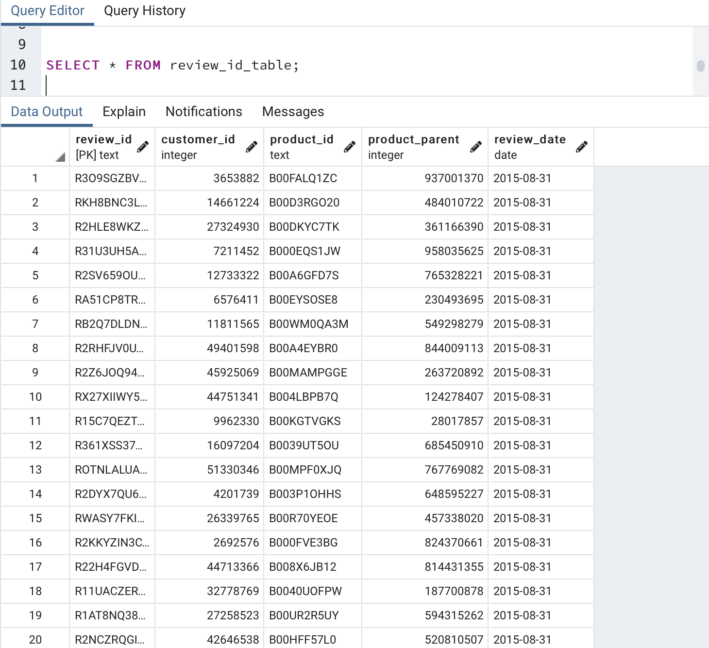
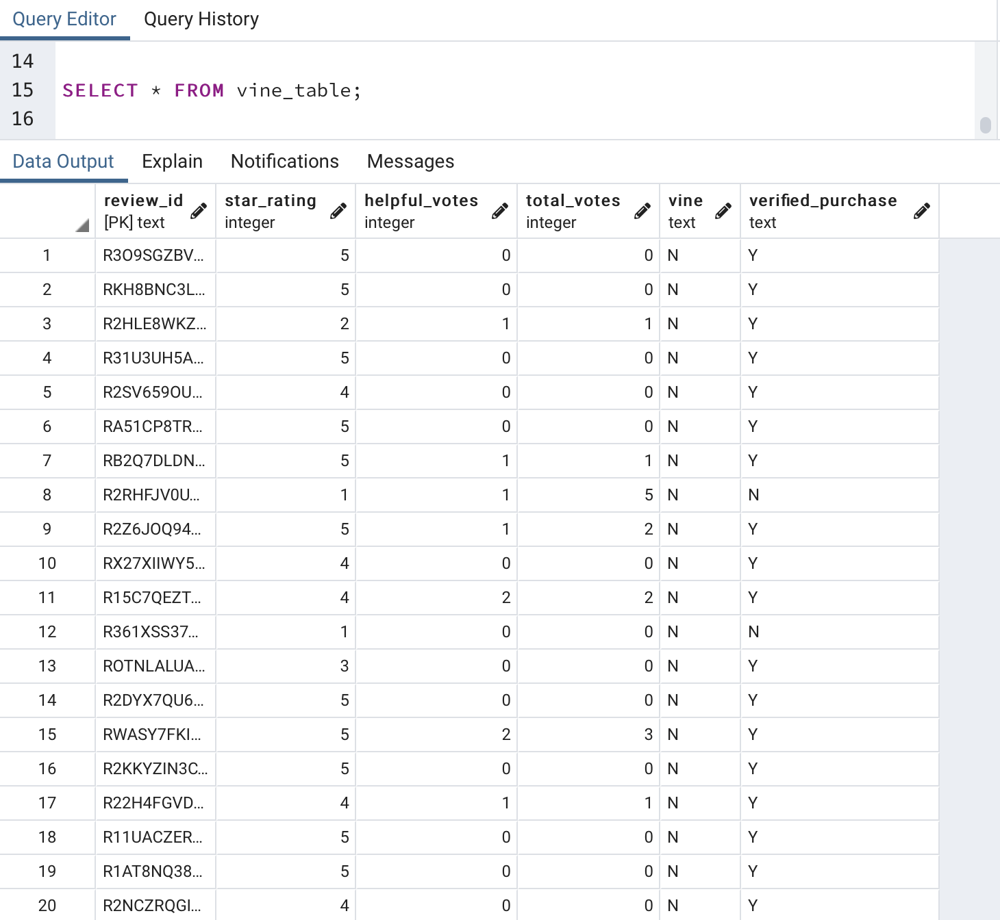
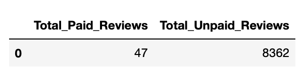
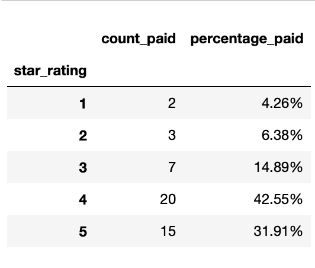
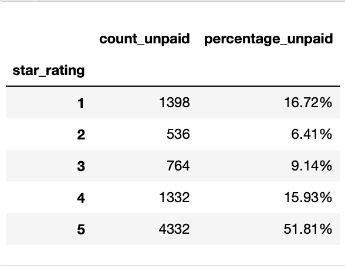
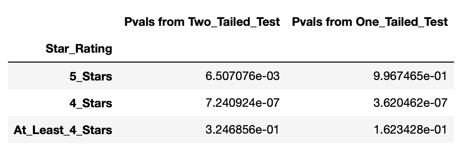

# Amazon Vine Analysis

# Overview of the Analysis
<p>

The study examined a dataset of 960,872 Amazon Product reviews on watches. It aimed to determine whether members of the Amazon Vine program were biased towards positive reviews about the products they received for free. Results from the study will help retailers decide whether paying Amazon for this service and providing its Vine members with free products are worth it.

Using Pyspark, the dataset was extracted, transformed and then loaded to a PostgresSQL database hosted on Amazon Web Services (AWS). The data was then loaded to a Pandas DataFrame and filtered into reviews written by members and non-members of the Amazon Vine Program. The reviews from both sources were then grouped by star rating with their frequencies displayed. Further statistical analysis to confirm any positive bias was done using the statsmodel library to perform hypothesis tests on the difference in population proportions from two independent samples. 
</p>

# Results

<p>
The following tables were loaded to an AWS hosted PostgresSQL database. 
</p>
<p align="center">
    <strong>Customers Table </strong> <br>
    
</p>
<p align="center">
    <strong>Products Table </strong> <br>
    
</p>
<p align="center">
    <strong>Review ID Table </strong> <br>
    
</p>
<p align="center">
    <strong>Vine Table </strong> <br>
    
</p>

<p>
The following data frames display the frequencies of star ratings after filtering the reviews from members (paid) and non-members (unpaid) of the Vine Program. 
</p>


<p align="center">
    <strong> Total Paid and Unpaid Reviews </strong> <br>
    
</p>

<p align="center">
    <strong> Paid Reviews Rating Frequency </strong> <br>
    
</p>

<p align="center">
    <strong> Unpaid Reviews Rating Frequency </strong> <br>
    
</p>


Key Insights
-  There were 47 total paid reviews written by Vine members and 8362 unpaid reviews written by non-Vine members.
- Among the 47 Vine reviews, 15 reviews were 5 stars while 4332 reviews out of the 8362 non-Vine reviews were 5 stars.
- Five star ratings were reported in 31.91% of the Vine reviews and 51.81% of the non-Vine reviews.  


# Summary

<p>
There is insufficient evidence to support the claim that Amazon Vine members exhibit a positive bias towards favourable product reviews. 

Although the proportion of four star reviews among Amazon Vine members exceeded that of non-Vine members at 42.55% and 15.93% respectively, the same positive bias was not observed when comparing the proportion of 5 star ratings between the two groups. In fact, the data indicated that a larger proportion of non-Vine members wrote five star product reviews relative to Vine members at 51.81% and 31.91% respectively. 

To support these results, several hypothesis tests on the difference in proportions of diffferent ratings from vine and non-vine reviews were performed. The following tests are outlined below followed by a summary of their resulting p values. 
</p>

```
# Hypothesis Testing on the Difference of Two Proportions of 5 Star Rated Reviews from 2 Independent Populations (Paid and Unpaid)

# Let P1 = proportion of reviews rated 5 stars by Vine members (paid)
# Let P2 = proportion of reviews rated 5 stars by non-Vine members (unpaid)

    # Two-tailed Test:  H0: P1-P2 = 0   |  H1: P1-P2 != 0 

    # One-tailed Test:  H0: P1-P2 = 0   |    H1: P1-P2 > 0 
```


```
# Hypothesis Testing on the Difference of Two Proportions of 4 Star Rated Reviews from 2 Independent Populations (Paid and Unpaid)

# Let P1 = proportion of reviews rated 4 stars by Vine members (paid)
# Let P2 = proportion of reviews rated 4 stars by non-Vine members (unpaid)
    
    # Two-tailed Test:  H0: P1-P2 = 0   |   H1: P1-P2 != 0 
    
    # One-tailed Test:  H0: P1-P2 = 0   |   H1: P1-P2 > 0 
```
```
# Hypothesis Testing on the Difference of Two Proportions of Reviews Rated at Least 4 stars from 2 Independent Populations (Paid and Unpaid)

# Let P1 = proportion of reviews rated at least 4 stars by Vine members (paid)
# Let P2 = proportion of reviews rated at least 4 stars by non-Vine members (unpaid)

# Two-tailed Test:  H0: P1-P2 = 0    |   H1: P1-P2 != 0 

# One-tailed Test:  H0: P1-P2 = 0    |   H1: P1-P2 > 0 
```

<p align="center">
    <strong> P values from Hypothesis Testing</strong> <br>
    
</p>


<p>
When comparing the proportion of 5 star ratings between Vine and non-Vine members, we have sufficient evidence at a 5% level of significance to support the claim that the proportions are unequal. However, the large p value from the one tailed test prevents us from concluding that the proportion of 5 star ratings from Vine members is greater than that of non-Vine members.

When comparing the proportion of 4 star ratings between Vine and non-Vine members, we have sufficient evidence at a 5% level of significance to support the claim that the proportions are unequal. Given the small p values from the one tailed test, we also have sufficient evidence at the same significane level to support the claim that the proportion of 4 star ratings from Vine members is greater than that of non-Vine members.


When comparing the proportion of reviews rated at least 4 stars between Vine and non-Vine members, we have insufficient evidence at a 5% level of significance to support the claim that the proportions are unequal. 
This implies that we cannot rule out the possibility that there is no statistical difference in proportion of reviews rated at least 4 stars between Vine and non-Vine members. Therfore, we cannot conclude that Amazon Vine members are positively biased towards favourable product reviews.
</p>
